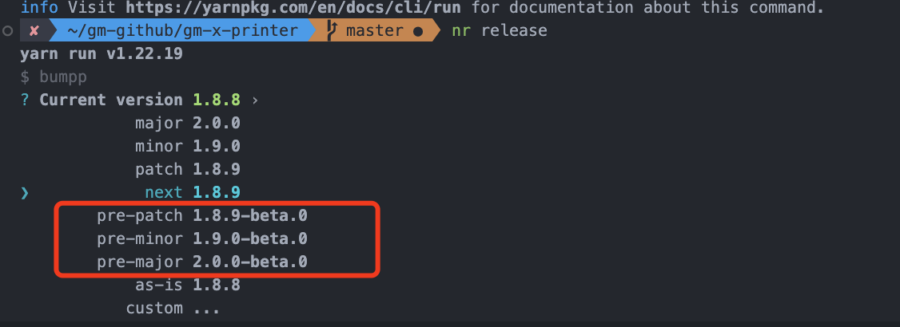
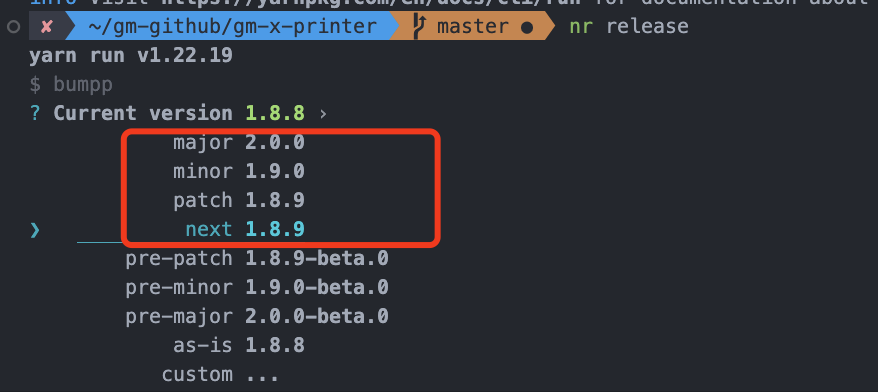
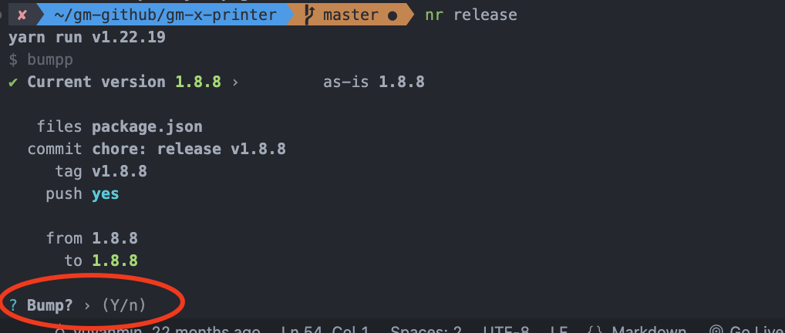
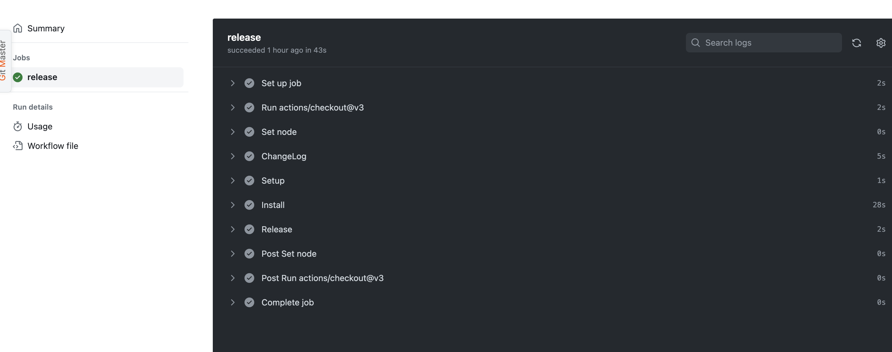
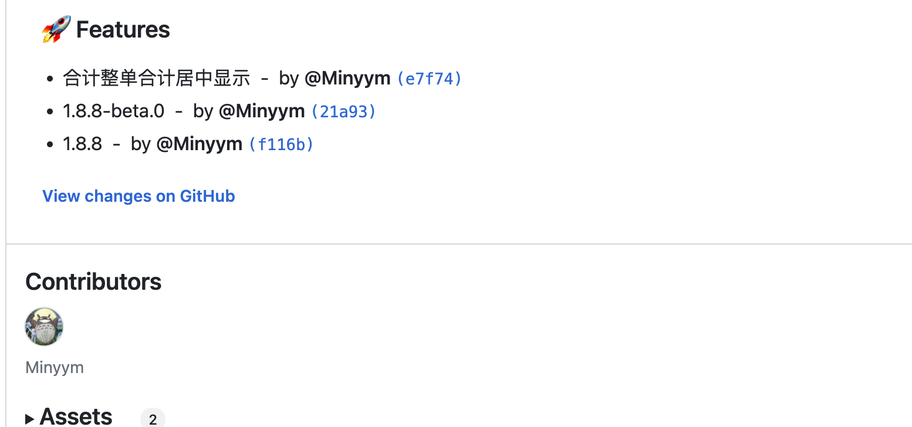

# gm-x-printer

gm-x-printer 是新架构 erp 使用的打印库

## 目录简要

```bash
├── src
│   ├── config.js # 一些printer配置信息
│   ├── data_to_key # 原始数据转换成打印数据
│   ├── editor # 右侧打印编辑界面
│   ├── index.js
│   ├── mock_data # 模拟数据
│   ├── printer # 打印区域
│   ├── template_config # 打印模板配置文件
│   └── util.js
├── locales # 多语言文件
```

## 预安装

- [NodeJS](https://nodejs.org/en/)
- [yarn](https://yarnpkg.com/getting-started/install)
- [Git](https://git-scm.com/downloads)
- [VSCode](https://code.visualstudio.com/download)（推荐）

## 运行 gm-x-printer

```JS
1. yarn（安装依赖）
2. yarn start（启动项目）
3. 启动项目后可以看到文件夹的目录，选择demo文件夹，就会显示常用的打印模板
```

## 与 erp 进行连接测试

1. 在 gm-x-printer 中，使用`yarn link`
2. 在 gm-static-x-erp 中使用`yarn link 'gm-x-printer'`,这样就连接上了 gm-x-printer 组件库，改动组件库的时候，就可以在 gm-static-x-erp 看到效果
3. 断开连接，先在 gm-x-printer 中使用`yarn unlink`,在 gm-static-x-erp 中运行`yarn unlink 'gm-x-printer'`,重新 yarn 和 yarn start 一下
4. 可能断开连接不太好用，不好用的时候，删除 node_modeles，关闭 gm-x-printer，重新 yarn
5. yarn link 不太稳定

## 与 pnpm 进行连接测试
1. 在 gm-x-printer 执行 `yarn build:watch`
2. 在 gm-x-printer 中，执行 `pnpm link --global`
3. 在需要连接的项目中执行 `pnpm link --global gm-x-printer`

## 版本命名规则

1. GNU 风格的版本号命名格式：主版本号 . 子版本号 [. 修正版本号 [. 编译版本号 ]]，示例 : 1.2.1 （正式版本）, 1.2.1-beta.0(测试版本)
2. 版本号管理策略:
   1. 项目最初版本为 1.0.0（npm 上最初的 10.11.3-beta0 的原因是 gm-x-printer 是从 gm-printer 上 feature/迁移出来的，没有影响不用在乎）
   2. 当项目在进行了局部修改或 bug 修正时，主版本号和子版本号都不变，修正版本号加 1；示例：1.0.1
   3. 当项目在原有的基础上增加了部分功能时，主版本号不变，子版本号加 1，修正版本号复位为 0。示例：1.1.0
   4. 当项目在进行了重大修改或局部修正累积较多，而导致项目整体发生全局变化时，主版本号加 1.示例：2.1.0

## 版本发布

gm-x-printer 是一个单独的打印库，使用 github action 发布版本

1. beta版本包的版本发布(在自己的feature|fix分支)，执行yarn release 后选择beta版本

   

2. 正式版本的发布

   1. 提pr到master
   2. 切换到master，之后执行yarn release选择正式版本（注意minor和patch的区别)

3. 选择后版本后再输入y，会自动生成tag和push，触发github action的release.yml，且生成changelog





自此自动发包完成！

## 模板文件(template_config)

config 主要是有下面 6 大部分组成

```js
export default {
  name: '模板名称', // 模板名称
  page: {}, // 模板整体的配置信息
  header: {}, // 页眉(每页都会渲染)
  contents: {}, // 主要内容(contents只渲染一次!第一页放不下,会顺延到次页继续渲染,直至全部渲染)
  sign: {}, // 签名(只在最后一页渲染)
  footer: {} // 页脚(每页都会渲染)
}
```

一个简单模板配置如下

```js
export default {
  name: '模板名称',
  page: {
    name: 'A4', // 打印纸张名称
    type: 'A4', // 打印纸张规格(如:A5,A6...)
    size: {
      width: '210mm', // 纸张宽度
      height: '297mm' // 纸张高度
    },
    printDirection: 'vertical', // 打印布局方向(两种: vertical, horizontal)
    gap: {
      // 纸张内边距
      paddingRight: '5mm',
      paddingLeft: '5mm',
      paddingBottom: '5mm',
      paddingTop: '5mm'
    }
  },
  header: {
    // 页眉
    blocks: [
      // blocks数组,里面元素
      {
        text: '收货人: {{收货人}}', // 文本块
        style: {
          // 文本块样式
          right: '',
          left: '450px',
          position: 'absolute',
          top: '6px'
        }
      }
    ],
    style: {
      // header 的样式
      height: '97px'
    }
  },
  contents: [
    // contents数组,元素是object.
    {
      blocks: [
        {
          text: '收货人: {{收货人}}', // 模板字符串用{{}}表示
          style: {
            right: '',
            left: '450px',
            position: 'absolute',
            top: '6px'
          }
        }
      ],
      style: {
        height: '78px'
      }
    },
    {
      blocks: [
        {
          type: 'counter', //  type类型为 'counter'是表格上面的类别和商品数小表格
          style: {}
        }
      ],
      style: {
        height: 'auto'
      }
    },
    {
      className: '',
      type: 'table', // type 表明是table
      dataKey: 'orders_category', // table的接受哪些数据. dataKey详细看下文
      subtotal: {
        // 是否显示table每页合计
        show: false
      },
      columns: [
        // 表单列配置
        {
          head: '序号',
          headStyle: {
            // 表头样式
            textAlign: 'center'
          },
          style: {
            // 表格样式
            textAlign: 'center'
          },
          text: '{{列.序号}}' // 表格内容
        }
      ]
    }
  ],
  sign: {
    // 签名(只在最后一页打印)
    blocks: [
      {
        text: '签收人：',
        style: {
          left: '600px',
          position: 'absolute',
          top: '5px'
        }
      }
    ],
    style: {
      height: '46px'
    }
  },
  footer: {
    // 页脚
    blocks: [
      {
        text: '页码： {{当前页码}} / {{页码总数}}',
        style: {
          right: '',
          left: '48%',
          position: 'absolute',
          top: '0px'
        }
      }
    ],
    style: {
      height: '15px'
    }
  }
}
```

## addFields

右侧的添加字段数据

```js
├── commonFields # 块区域的添加字段
├── summaryFields # 合计汇总字段
├── tableFields # 表格区域的添加字段
```

## data 数据

1. common：非表格数据
2. \_origin:原始数据
3. \_table：表格数据（根据模板的不同，进行整理数据）
   1. orders: kOrders, // 普通
   2. orders_multi: kOrdersMulti, // 双栏
   3. orders_multi_vertical: kOrdersMultiVertical, // 双栏（纵向）
   4. orders_category: kCategory, // 分类
   5. orders_category_multi: kCategoryMulti, // 分类 + 双栏
   6. orders_category_multi_vertical: kCategoryMultiVertical, // 分类+双栏（纵向）
   7. .......

## 区域表示

```js
// header
// header.block.0
// contents.panel.0 //区域块
// contents.panel.0.block.0 //区域块的每一个块
// contents.table.0 //区域表格
// contents.table.0.column.0 // 区域表格的每一个表格
```
